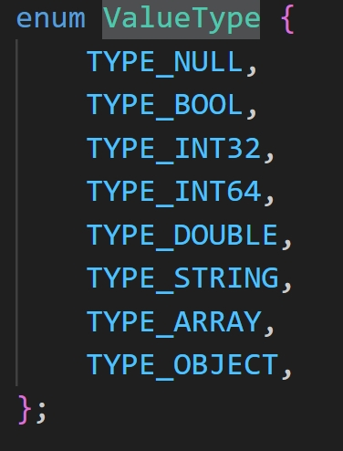
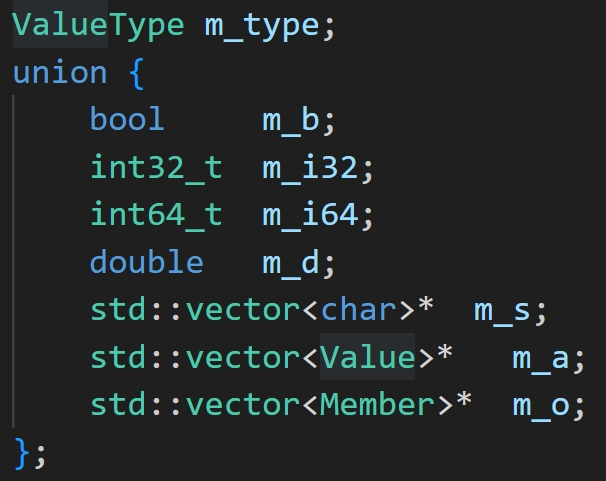
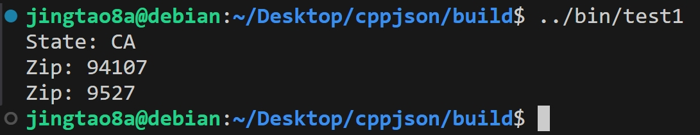
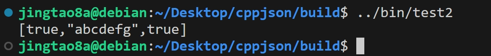

## cppjson: A simple 递归下降 JSON parser/generator


## 简介：
> 支持的数据JSON数据类型包括:
> NULL, BOOL, INT32, DOUBLE, STRING, ARRAY, OBJECT
> 使用union联合体存储value节省空间

 

## 四种自定义流(I/O)
- FileReadStream: 文件输入流
- FileWriteStream：文件输出流
- StringReadStream：字符串输入流
- StringWriteStream：字符串输出流
  
## Reader、Writer、Document、PrettyWriter
- Reader: 负责递归下降解析文本字符串
- Writer: 负责将指定Value转化为JSON字符串
- Document: 继承Value,使用DOM(Document Object Model)风格的API
- PrettyWriter: 美化Writer的输出

## 解析JSON
***
``` cpp
#include <cppjson/Document.hpp>
#include <iostream>
#include <cppjson/Exception.hpp>
using namespace cppjson;

int main()
{
    Document document;
    ParseError err = document.parse("{"
    "    \"precision\": \"zip\","
    "    \"Latitude\": 37.766800000000003,"
    "    \"Longitude\": -122.3959,"
    "    \"Address\": \"\","
    "    \"City\": \"SAN FRANCISCO\","
    "    \"State\": \"CA\","
    "    \"Zip\": \"94107\","
    "    \"Country\": \"US\""
    "    }");

    if (err != PARSE_OK) {
        puts(ParseErrorStr(err));
        exit(1);
    }

    // get 'State' field
    Value& state = document["State"];
    std::cout << "State: " << state.getString() << '\n';

    // get 'Zip' field
    Value& zip = document["Zip"];
    std::cout << "Zip: " << zip.getString() << "\n";

    // set 'Zip' field
    zip.setInt32(9527);
    std::cout << "Zip: " << zip.getInt32() << "\n";
}
```
输出：



## 生成JSON

``` cpp
#include <cppjson/Writer.hpp>
#include <cppjson/FileWriteStream.cpp>
#include <iostream>
using namespace cppjson;

int main()
{
    FileWriteStream os(stdout);
    Writer<FileWriteStream> writer(os);

    writer.StartArray();
    writer.Bool(true);
    writer.String("abcdefg"); // null character is OK
    writer.Bool(true);
    writer.EndArray();
    std::cout << std::endl;
    return 0;
}
```
输出：


## 安装
``` shell
$ git clone git@github.com:jingtao8a/cppjson.git
$ cd cppjson
$ git submodule update --init --recursive
$ mkdir build & cd build
$ cmake ..
$ make install
```

## 参考
- [JSON tutorial](https://github.com/miloyip/json-tutorial):从零开始的JSON库教程
- [jackson项目](https://github.com/guangqianpeng/jackson?tab=readme-ov-file): 夕阳武士（[作者知乎账号](https://www.zhihu.com/people/pen-frank-68/posts)）
  